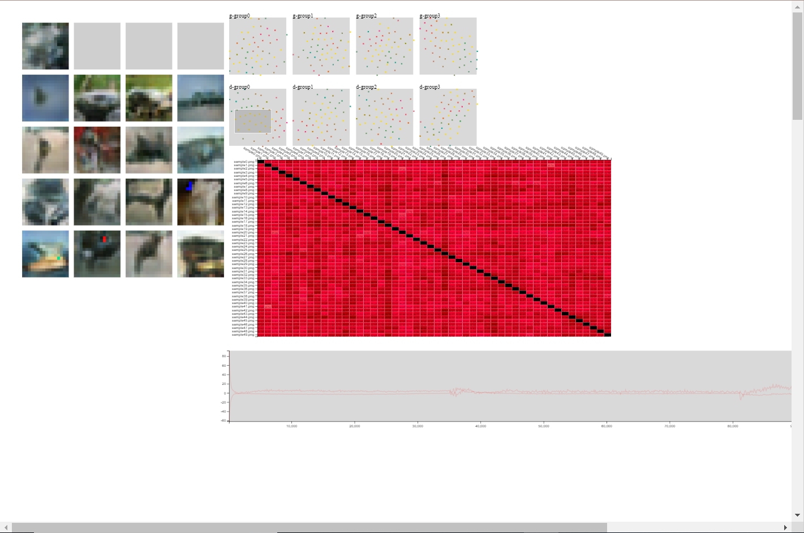

# Human-in-the-Loop Training of Generative Models

This project is builds on Facebook's PyTorch GAN Zoo (https://github.com/facebookresearch/pytorch_GAN_zoo) using the CIFAR10 dataset

## Requirements
    - pytorch
    - numpy
    - torchvision
    - scipy
    - visdom (optional, for monitoring training)

## Usage
### Training the model (Progressive GAN, WGANGP loss)
- Activate visdom server before training to monitor progress (optional):
    - python -m visdom.server
    
- Train PGAN, load most recently saved model. Save every (S) iterations (minibatches, batch size 16). Run this in another shell.
    - python train.py PGAN -c config_cifar10.json -n cifar10 -s (S)

- navigate to the url specified in visdom shell (usually http://localhost:8097) to monitor training

### Visualization
- generate (N) new feature map samples (size 200x200) without training the model
    - python train.py PGAN -c config_cifar10.json -n cifar10 -nS (N) -xT
    python train.py PGAN -c config_cifar10.json -n cifar10 -nS 150 -xT
- Prep loss binary for visualization
    - python helpers.py
- Activate the web server: '''python -m http.server'''
- navigate to http://localhost:8000/pgan_vis/

## To do
- 11-3 - 11-9
    - input plot; 
    - colormap for all netG and netD layers based on input plot
    - discriminator layers; colormap;

- 11-10 - 11-16:
    - interactivity:
        - brush select
        - image grid

- 11-17 - 11-23:
    - brush
    - change sample layers 
    - image grid

- 11-24 - 11-30:
    - image grid

- 12-15 - 12-21;
    - fix image grid
    - image scaling issue

- model training error (RAM)
- loss function for evaluating distance between samples

